---
## Author
author:
  name: Чамочумби Аксель
  affiliation:
    - name: Российский университет дружбы народов
      country: Российская Федерация
      postal-code: 117198
      city: Москва
      address: ул. Миклухо-Маклая, д. 6

## Title
title: "Введение в Linux"
subtitle: "Введение"
license: "CC BY"
---

# Цель работы

закрепление изученного материала через решение задач. 

# Задание

Ответить на вопросы которые заданы в степике

## Выполнение внешнего курса 

# Выполнение 1.1 Общая информация о курсе

B первом подблоке этого этапа представленны наипростейшие задания, которые не требуют пояснений и служат только ради того, чтобы ознакомить нас со структурой курса ([рис. @fig-001]).

{#fig-001 width=70%}

## Выполнение 1.2. Как установить Linux

Аналогично с первым подблоком, во втором представленны наипростейшие задания, которые не требуют пояснений

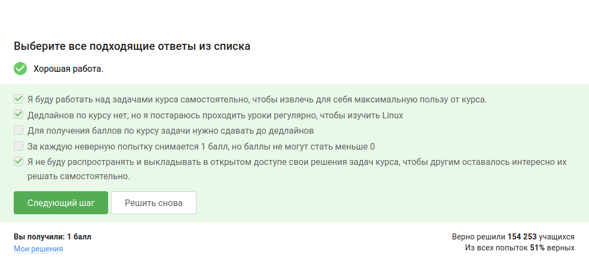{#fig-002 width=70%}

{#fig-003 width=70%}

{#fig-004 width=70%}

## Выполнение 1.3. Осваиваем Linux

Создали документ в LibreOffice Writer и написали в нём шрифтом FreeMono строчку: Нello, Linux! ([рис. @fig-005]).

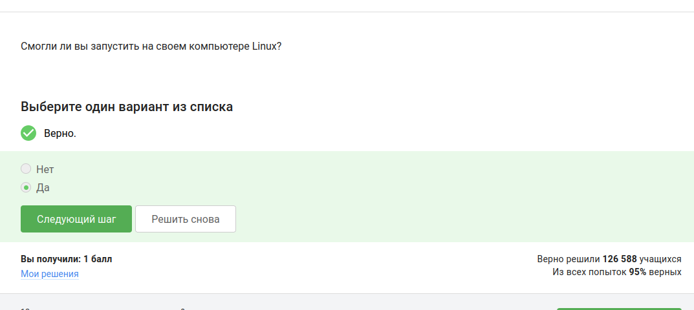{#fig-005 width=70%}

После этого сохранили этот документ в формате FODT и загрузили в форму ([рис. @fig-006]).

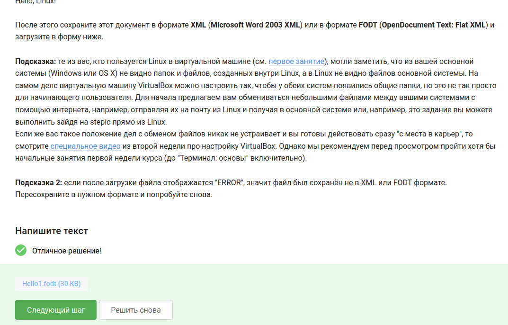{#fig-006 width=70%}

Установочные пакеты в Linux (Ubuntu) имеют расширение .deb ([рис. @fig-007]).

{#fig-007 width=70%}

Запустили плеер VLC, открыли Help - About, зашли во вкладку Authors ([рис. @fig-008]).

{#fig-008 width=70%}

Первая фамилия - Denis-Courmont. Ввели её на сайте ([рис. @fig-009]).

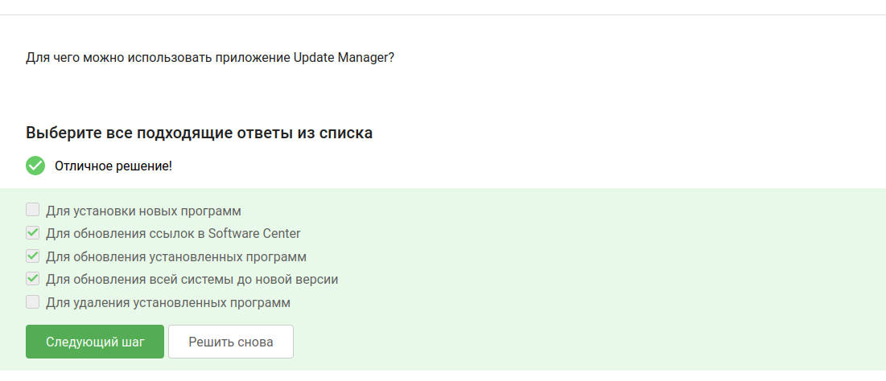{#fig-009 width=70%}

## Выполнение 1.4. Terminal: основы

Выбрали все синонимы для "командной строки" — Терминал и Консоль ([рис. @fig-010]).

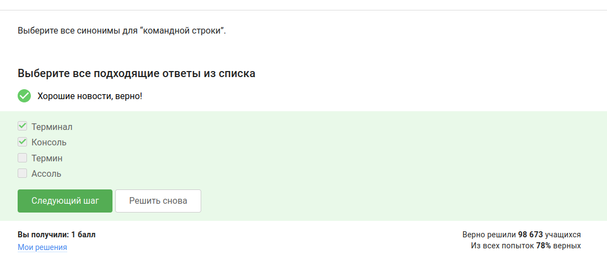{#fig-010 width=70%}

Команда для определения текущей директории — только `pwd` ([рис. @fig-011]).

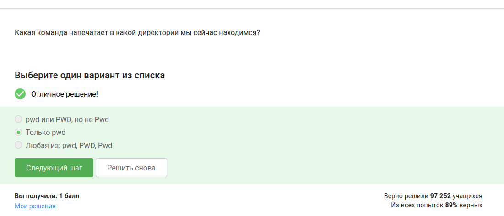{#fig-011 width=70%}

Эквивалентные команды для `ls -A --human-readable -l /some/directory` — `ls -Ahl`, `ls -h -A -l`, `ls --almost-all --human-readable -l`, `ls --human-readable -A -l` и `ls -lAh` ([рис. @fig-012]).

{#fig-012 width=70%}

Из директории `/home/bi/Documents` содержимое `/home/bi/Downloads` выводится командами `ls /home/bi/Downloads`, `ls ../Downloads` и `ls ~/Downloads` ([рис. @fig-013]).

{#fig-013 width=70%}

Команда для удаления директорий — `rm -r` ([рис. @fig-014]).

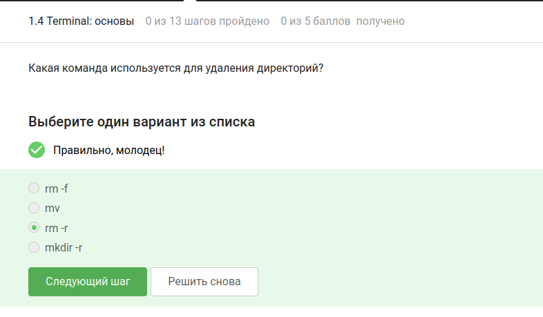{#fig-014 width=70%}

## Выполнение 1.5. Запуск исполняемых файлов

После ввода `firefox`, а затем `exit` терминал закрылся, Firefox продолжил работу ([рис. @fig-015]).

{#fig-015 width=70%}

Запуск программы с `&` эквивалентен запуску, затем `Ctrl+Z` и `bg` ([рис. @fig-016]).

{#fig-016 width=70%}

Скачали файл, сделали исполняемым, запустили и скопировали вывод. Программа вывела `2026-05-13 07:26:04`, контрольная сумма `948` ([рис. @fig-017]).

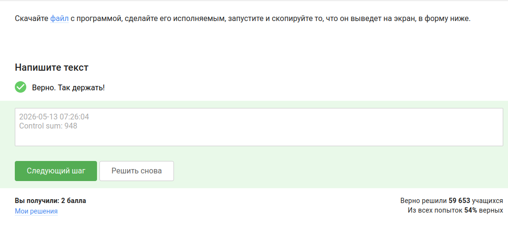{#fig-017 width=70%}

## Выполнение 1.6. Ввод / вывод

Поток ошибок из программы, запущенной в терминале, по умолчанию выводится на экран ([рис. @fig-018]).

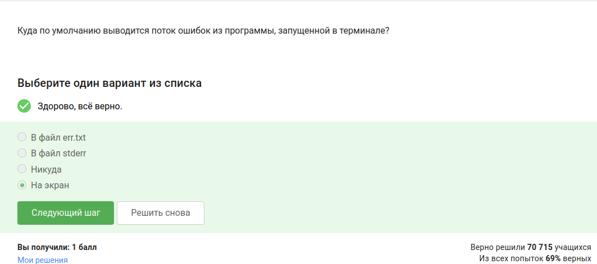{#fig-018 width=70%}

Команды, которые создадут файл `file.txt` и запишут в него поток ошибок программы `program` — `program 2>> file.txt` и `program 2> file.txt` ([рис. @fig-019]).

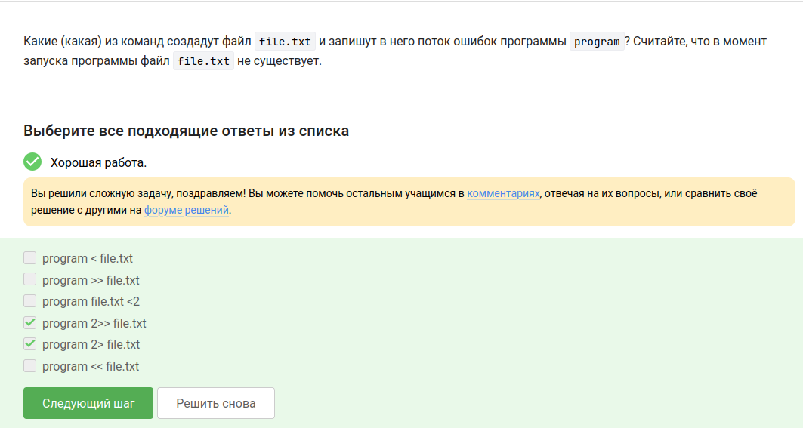{#fig-019 width=70%}

Сообщения об ошибках (stderr) от программ, объединённых в конвейер (pipe), выводятся на экран ([рис. @fig-020]).

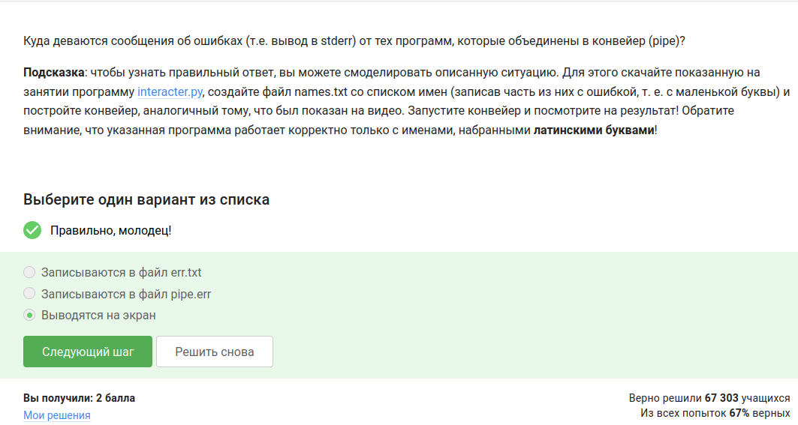{#fig-020 width=70%}

## Выполнение 1.7. Скачивание файлов из интернета

После выполнения команд `cd /home/alex/` и `wget -P /home/alex/Pictures -O 1.jpg http://example.com/example.jpg` картинка окажется в файле `/home/alex/1.jpg` ([рис. @fig-021]).

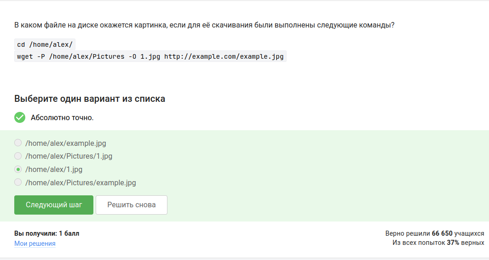{#fig-021 width=70%}

Опция команды `wget`, чтобы она не выводила никаких сообщений на экран — `-q` или `--quiet` ([рис. @fig-022]).

{#fig-022 width=70%}

При запуске `wget -r -l 1 -A jpg` будут скачаны jpg и html файлы, но все html будут удалены ([рис. @fig-023]).

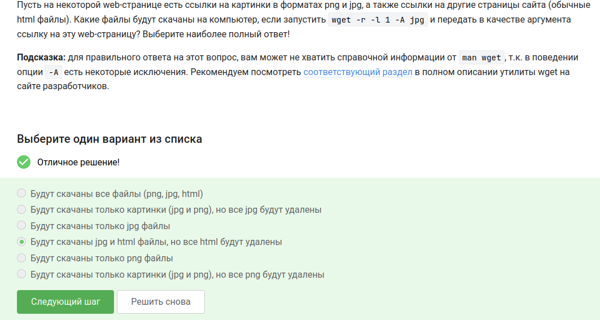{#fig-023 width=70%}

## Выполнение 1.8. Работа с архивами

Отличие архиваторов `gzip` и `zip` (при параметрах по умолчанию) — `gzip` удаляет архив после его распаковки ([рис. @fig-024]).

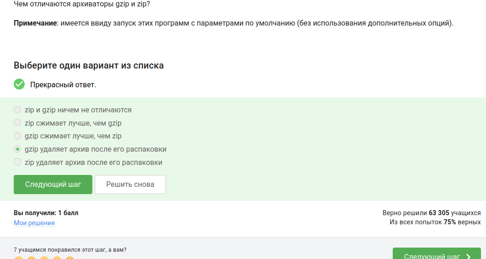{#fig-024 width=70%}

Архиваторы, которые могут создать архив из директории с файлами — `zip` и `tar` ([рис. @fig-025]).

{#fig-025 width=70%}

Набор опций для `tar`, чтобы запаковать файлы в `my_archive.tar.bz2` — `-cjf` ([рис. @fig-026]).

{#fig-026 width=70%}

## Выполнение 1.9. Поиск файлов и слов в файлах

Маски команды `find`, которые НЕ найдут файл `Alexey.jpeg` — `alexey.*`, `*.jpg`, `*.?` ([рис. @fig-027]).

{#fig-027 width=70%}

Команда `grep "world" text.txt` выведет строки, содержащие подстроку `world` (независимо от окружения символами), но не отдельное слово `World` с заглавной буквы ([рис. @fig-028]).

{#fig-028 width=70%}

Нашли в произведениях Шекспира строки, содержащие `love`, и загрузили файл в форму ([рис. @fig-029]).

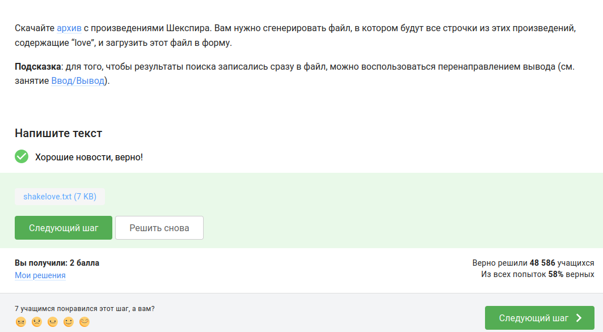{#fig-029 width=70%}

## Выводы

В ходе выполнения практических заданий с 1.4 по 1.9 были освоены основные навыки работы в терминале Linux: использование синонимов командной строки (терминал, консоль), определение текущей директории (`pwd`), эквивалентные опции `ls`, рекурсивное удаление директорий (`rm -r`), запуск программ в фоне (`&`, `Ctrl+Z`, `bg`), перенаправление потоков ошибок (`2>` и `2>>`), скачивание файлов (`wget` с опциями `-q`, `-P`, `-O`, `-r`, `-l`, `-A`), работа с архиваторами (`zip`, `tar`, `gzip`) и поиск файлов и слов (`find`, `grep`).

# Список литературы{.unnumbered}

https://stepik.org/course/73

::: {#refs}
:::
