## Докладчик

:::::::::::::: {.columns align=center}
::: {.column width="70%"}

  * **Чамочумби Аксель**
  * Студент
  * Российский университет дружбы народов
  * [1032252367@rudn.ru](mailto:1032252367@rudn.ru)

:::
::: {.column width="30%"}

:::
::::::::::::::

# Цель работы

закрепление изученного материала через решение задач. 

# Задание

Ответить на вопросы которые заданы в степике

## Выполнение внешнего курса 

# Выполнение 1.1 Общая информация о курсе

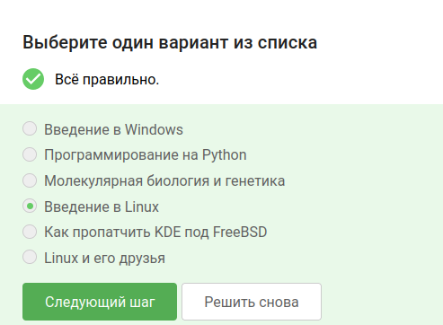{#fig-001 width=70%}

## Выполнение 1.2. Как установить Linux

{#fig-002 width=70%}

## Выполнение 1.2. Как установить Linux

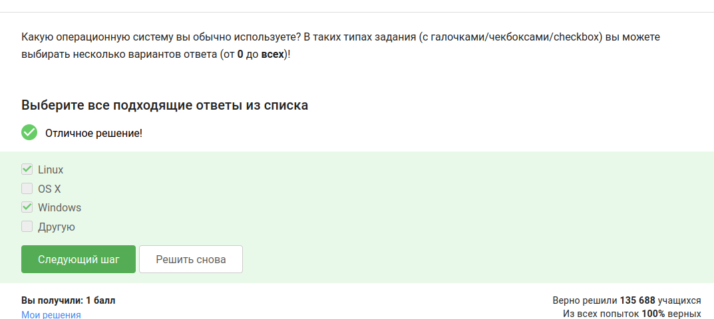{#fig-003 width=70%}

## Выполнение 1.2. Как установить Linux

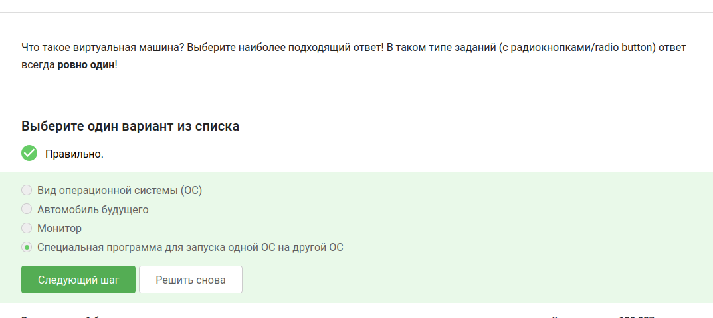{#fig-004 width=70%}

## Выполнение 1.3. Осваиваем Linux

{#fig-006 width=70%}

## Выполнение 1.3. Осваиваем Linux

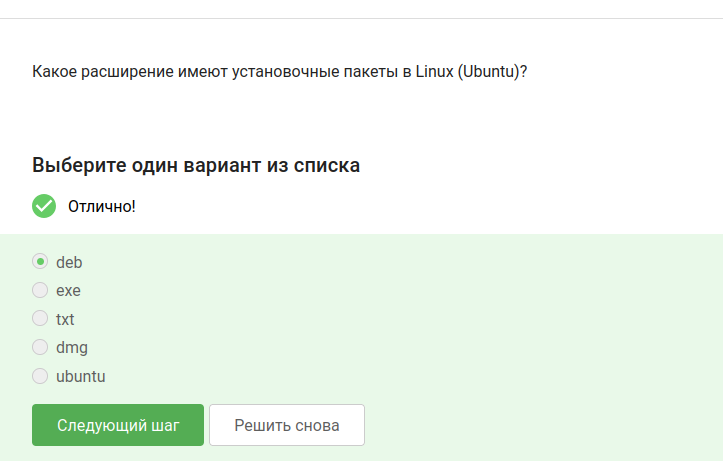{#fig-007 width=70%}

## Выполнение 1.3. Осваиваем Linux

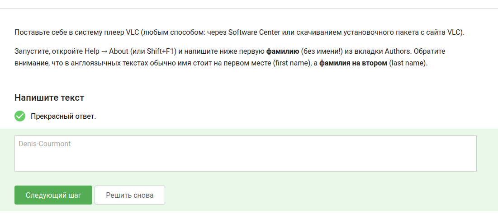{#fig-008 width=70%}

## Выполнение 1.3. Осваиваем Linux

{#fig-009 width=70%}

## Выполнение 1.4. Terminal: основы

{#fig-010 width=70%}

## Выполнение 1.4. Terminal: основы

{#fig-011 width=70%}

## Выполнение 1.4. Terminal: основы

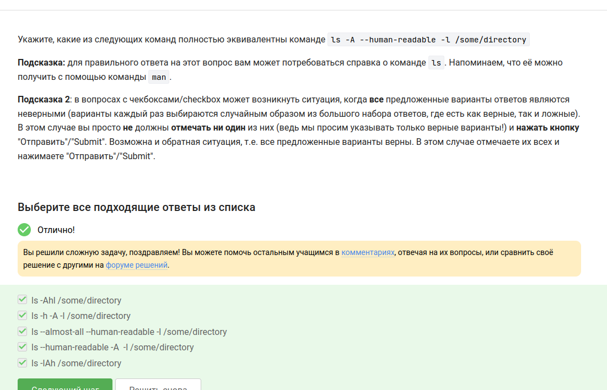{#fig-012 width=70%}

## Выполнение 1.4. Terminal: основы

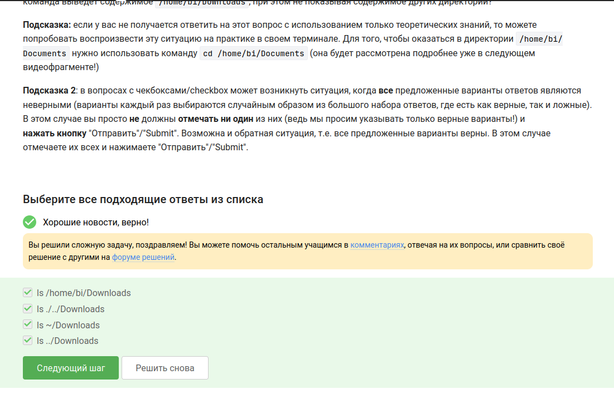{#fig-013 width=70%}

## Выполнение 1.4. Terminal: основы

{#fig-014 width=70%}

## Выполнение 1.4. Terminal: основы

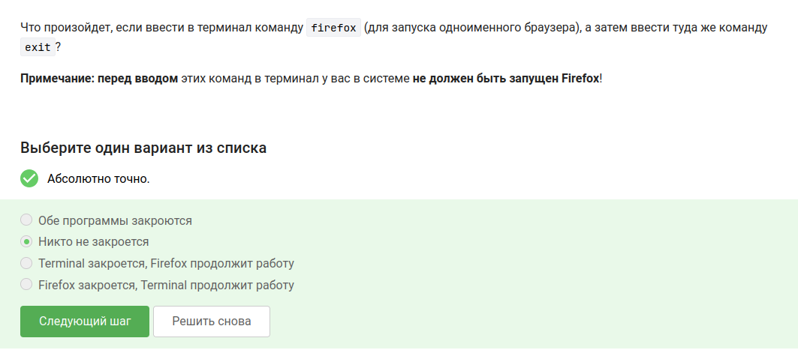{#fig-015 width=70%}

## Выполнение 1.4. Terminal: основы

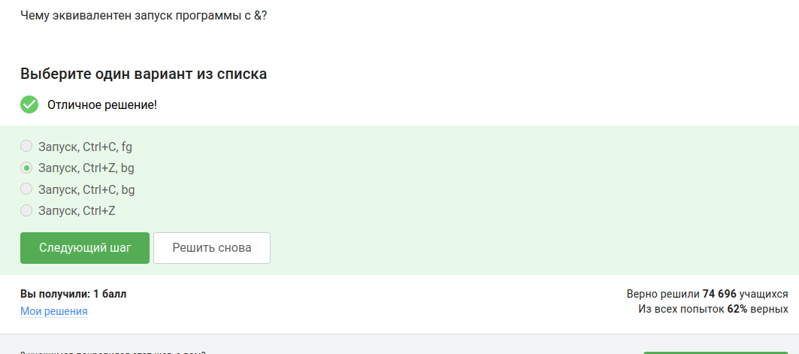{#fig-016 width=70%}

## Выполнение 1.4. Terminal: основы

{#fig-017 width=70%}

## Выполнение 1.6. Ввод / вывод

{#fig-018 width=70%}

## Выполнение 1.6. Ввод / вывод

{#fig-019 width=70%}

## Выполнение 1.6. Ввод / вывод

{#fig-020 width=70%}

## Выполнение 1.7. Скачивание файлов из интернета

{#fig-021 width=70%}

## Выполнение 1.7. Скачивание файлов из интернета

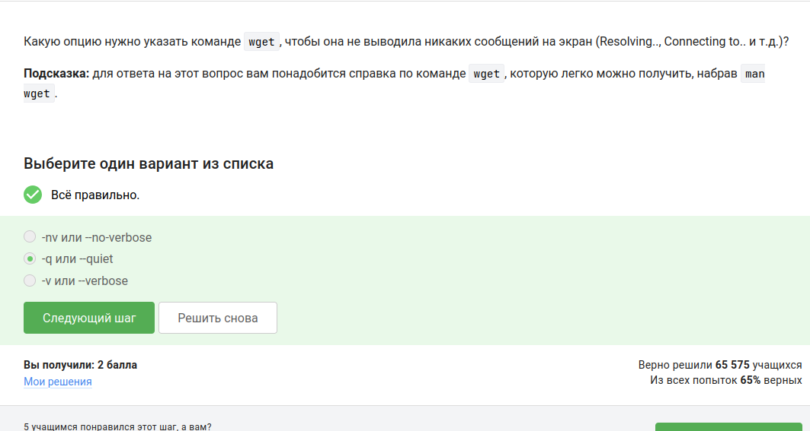{#fig-022 width=70%}

## Выполнение 1.7. Скачивание файлов из интернета

{#fig-023 width=70%}

## Выполнение 1.8. Работа с архивами

{#fig-024 width=70%}

## Выполнение 1.8. Работа с архивами

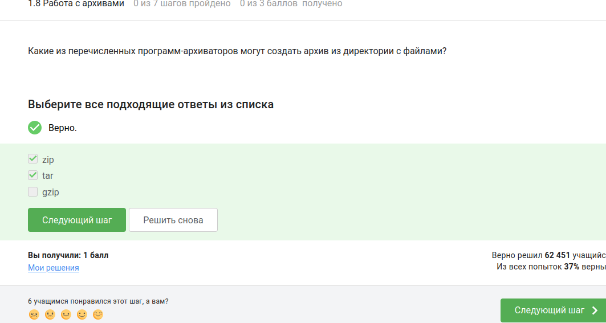{#fig-025 width=70%}

## Выполнение 1.8. Работа с архивами

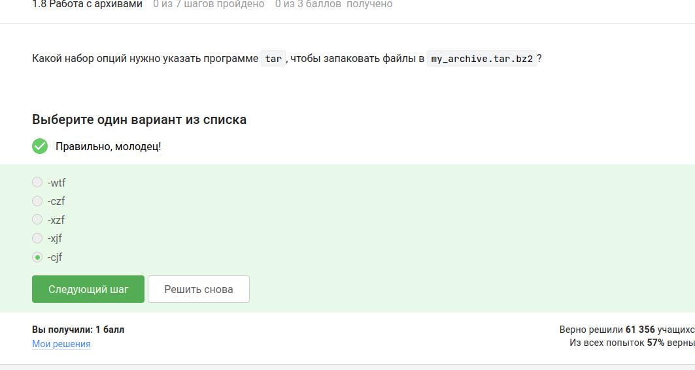{#fig-026 width=70%}

## Выполнение 1.9. Поиск файлов и слов в файлах

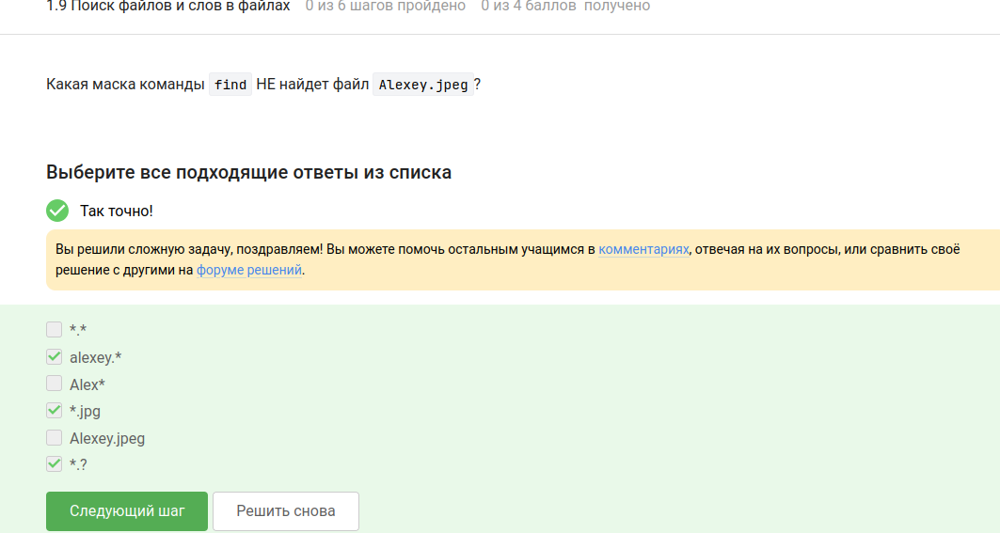{#fig-027 width=70%}

## Выполнение 1.9. Поиск файлов и слов в файлах

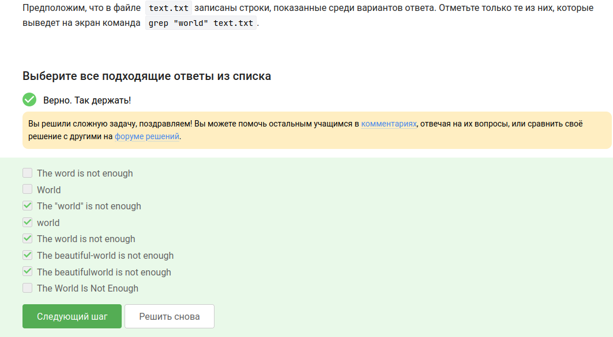{#fig-028 width=70%}

## Выполнение 1.9. Поиск файлов и слов в файлах

{#fig-029 width=70%}

## Выводы

В ходе выполнения практических заданий с 1.4 по 1.9 были освоены основные навыки работы в терминале Linux: использование синонимов командной строки (терминал, консоль), определение текущей директории (`pwd`), эквивалентные опции `ls`, рекурсивное удаление директорий (`rm -r`), запуск программ в фоне (`&`, `Ctrl+Z`, `bg`), перенаправление потоков ошибок (`2>` и `2>>`), скачивание файлов (`wget` с опциями `-q`, `-P`, `-O`, `-r`, `-l`, `-A`), работа с архиваторами (`zip`, `tar`, `gzip`) и поиск файлов и слов (`find`, `grep`).

# Список литературы{.unnumbered}

https://stepik.org/course/73

::: {#refs}
:::
