## Докладчик

:::::::::::::: {.columns align=center}
::: {.column width="70%"}

  * **Чамочумби Аксель**
  * Студент
  * Российский университет дружбы народов
  * [1032252367@rudn.ru](mailto:1032252367@rudn.ru)

:::
::: {.column width="30%"}

:::
::::::::::::::

## Цель

Закрепление изученного материала по разделу **"Работа на сервере"** курса "Введение в Linux" на платформе Stepik, а также освоение навыков удаленной работы с серверами, передачи файлов, управления процессами и использования терминального мультиплексора tmux.

## Задачи

1. Знакомство с удаленными серверами и SSH-ключами
2. Передача файлов с помощью SCP и Filezilla
3. Запуск приложений на сервере и получение справочной информации
4. Контроль запущенных процессов (jobs, top, ps, kill)
5. Работа с многопоточными приложениями
6. Освоение менеджера терминалов tmux

## 2.1. Знакомство с сервером

**Вопрос:** Для каких задач можно использовать удаленный сервер?  
**Ответ:** Хранение данных (общедоступных и конфиденциальных), выполнение сложных вычислений

{width=70%}

## SSH-ключи

**Вопрос:** Какой ключ можно без опаски пересылать по интернету?  
**Ответ:** Публичный ключ `id_rsa.pub`

{width=70%}

## 2.2. Обмен файлами

**Вопрос:** Как скопировать папку `stepic` на сервер?  
**Ответ:** `scp -r stepic username@server:~/`

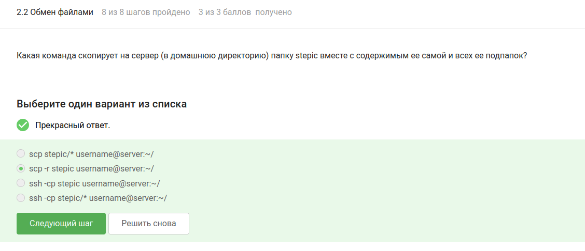{width=70%}

## Установка программ

**Вопрос:** Что делать, если `apt-get install` не находит пакет?  
**Ответ:** `sudo apt-get update`

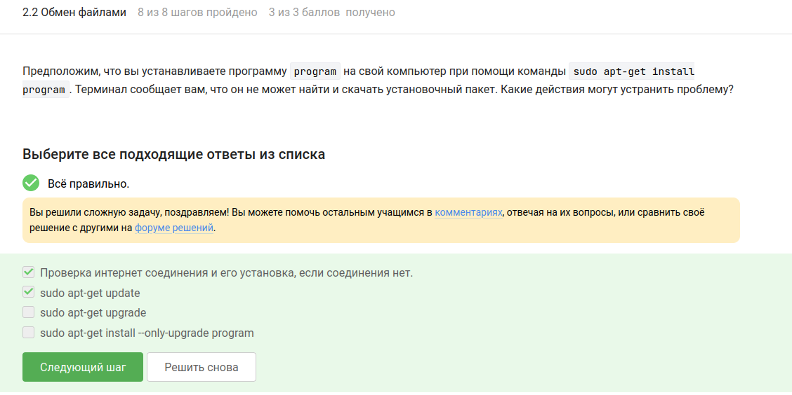{width=70%}

## Filezilla

**Вопрос:** Для чего используется Filezilla?  
**Ответ:** Копирование файлов с/на сервер, просмотр содержимого директорий

{width=70%}

## 2.3. Запуск приложений

**Вопрос:** Что делать, если программа требует графический экран?  
**Ответ:** Проверить наличие терминальной версии

{width=70%}

## Справочная информация

**Вопрос:** Как вызвать справку о программе?  
**Ответ:** `man program` или `program --help`

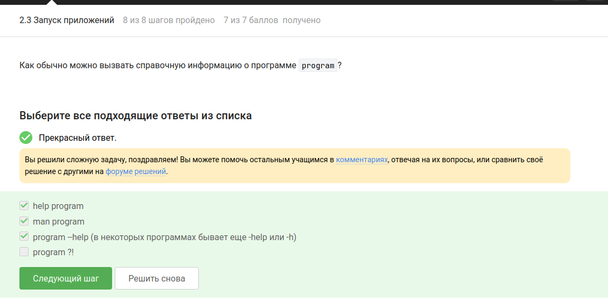{width=70%}

## FastQC: форматы данных

**Вопрос:** Какие форматы принимает FastQC?  
**Ответ:** fastq, fasta, seq

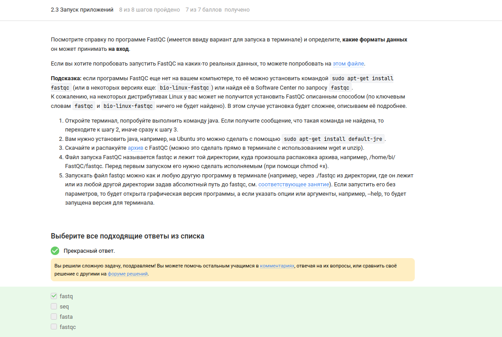{width=70%}

## Clustal: множественное выравнивание

**Вопрос:** Команда для запуска Clustal?  
**Ответ:** `clustalw test.fasta -align`

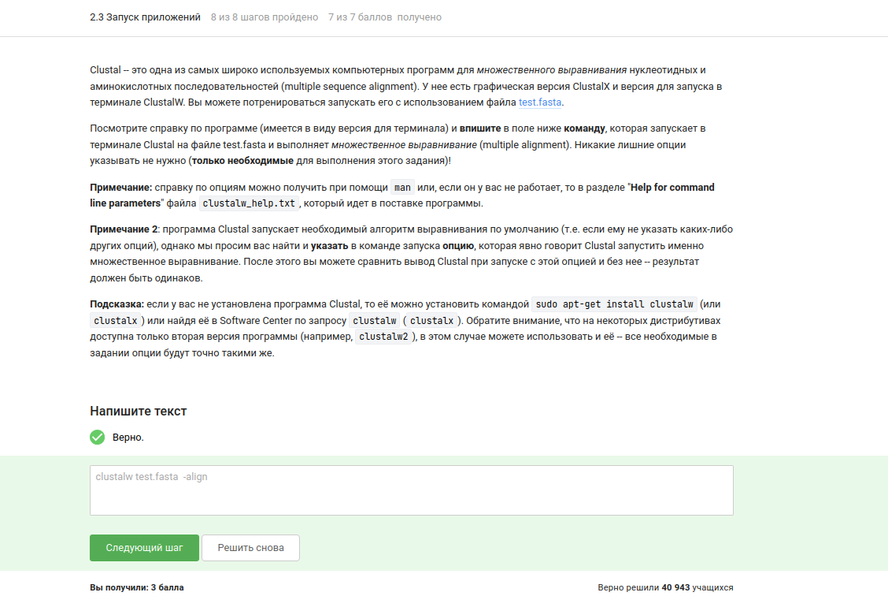{width=70%}

## 2.4. Контроль процессов

**Вопрос:** Одинаковые ли PID в jobs, top y ps?  
**Ответ:** Да, у всех одинаковые

{width=70%}

## Завершение процессов

**Вопрос:** Как мгновенно завершить процесс?  
**Ответ:** `kill -9`

**Вопрос:** Что делает `kill` sin opciones?  
**Ответ:** Завершает процесс

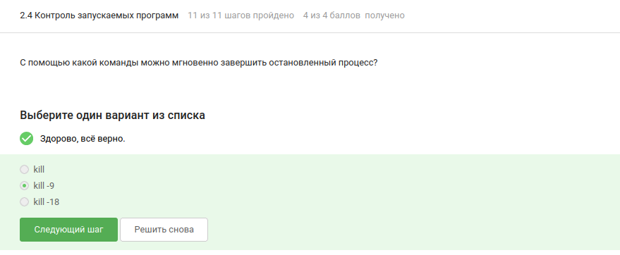{width=70%}
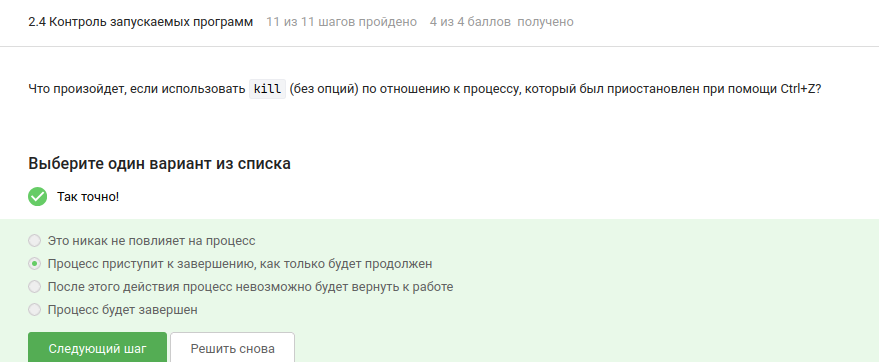{width=70%}

## 2.5. Многопоточные приложения: CPU

**Вопрос:** Сколько CPU использует остановленный (Ctrl+Z) процесс?  
**Ответ:** 0% CPU

{width=70%}

## Многопоточные приложения: память

**Вопрос:** Сколько памяти занимает остановленный процесс?  
**Ответ:** Столько же, сколько в момент остановки

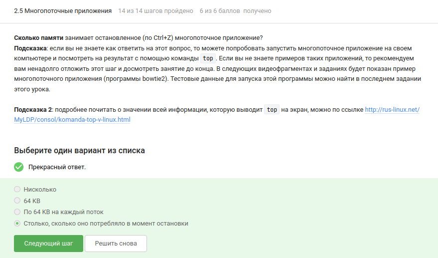{width=70%}

## Завершение потоков

**Вопрос:** Как завершить один поток?  
**Ответ:** Никак

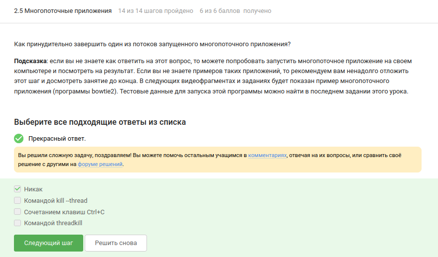{width=70%}

## Bowtie2

**Задание:** Запустили bowtie2 на предоставленных данных

{width=70%}

## 2.6. tmux: exit

**Вопрос:** Что будет при `exit` en la última pestaña?  
**Ответ:** tmux завершит работу

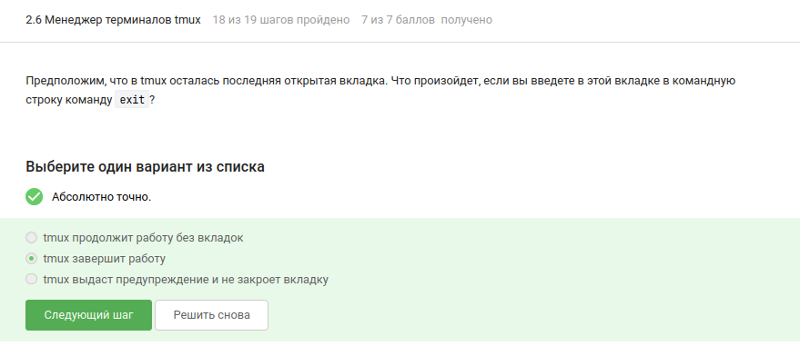{width=70%}

## tmux: закрытие терминала

**Вопрос:** Что будет, если закрыть терминал con tmux en el servidor?  
**Ответ:** Соединение прервется, но tmux продолжит работу

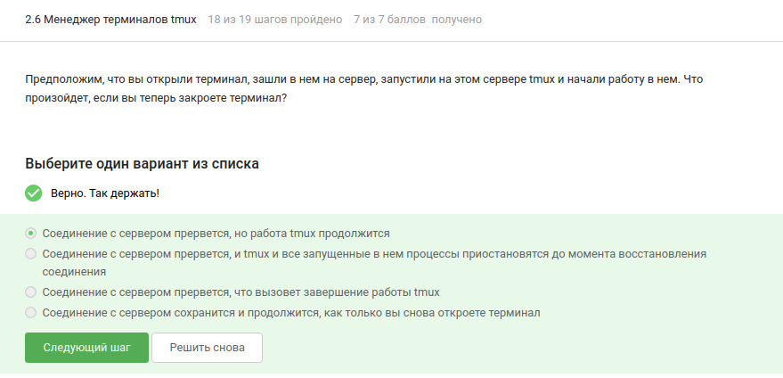{width=70%}

## tmux: закрытие вкладки

**Вопрос:** Что будет, если закрыть вкладку con proceso en segundo plano?  
**Ответ:** Вкладка y proceso se cierran

{width=70%}

## tmux: переименование вкладки

**Вопрос:** Как переименовать вкладку?  
**Ответ:** `Ctrl+B` y `,` (запятая)

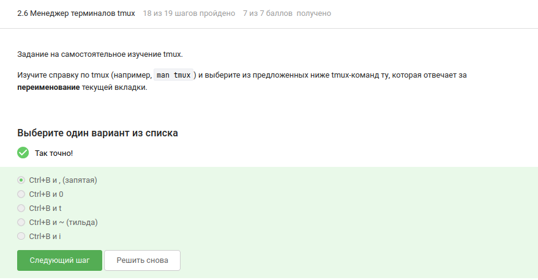{width=70%}

## tmux: разделение вкладок

**Afirmaciones verdaderas:**
- División horizontal + vertical da 3 partes
- Moverse entre partes: `Ctrl+B` + flechas
- Cerrar parte: `Ctrl+B` + `x`
- División actúa solo en la pestaña actual

{width=70%}

## Выводы

- **Подключение к серверам** — tareas del servidor, transferencia segura de claves SSH
- **Передача файлов** — `scp -r` y Filezilla
- **Установка программ** — `sudo apt-get update`, `man`, `program --help`
- **Контроль процессов** — `jobs`, `top`, `ps` (mismo PID), `kill` y `kill -9`
- **Multihilo** — proceso detenido: 0% CPU, memoria retenida, no se puede matar un hilo solo
- **tmux** — gestión de pestañas, división de pantalla, renombrar, sesiones persistentes

## Спасибо за внимание
