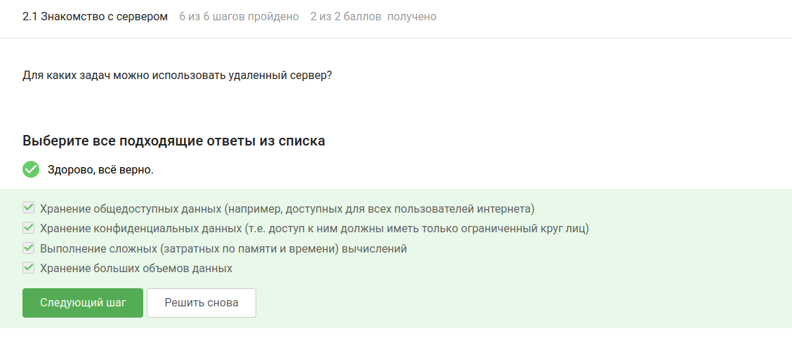
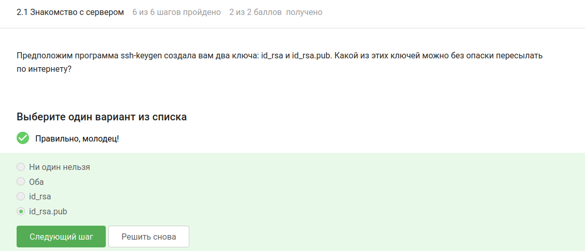
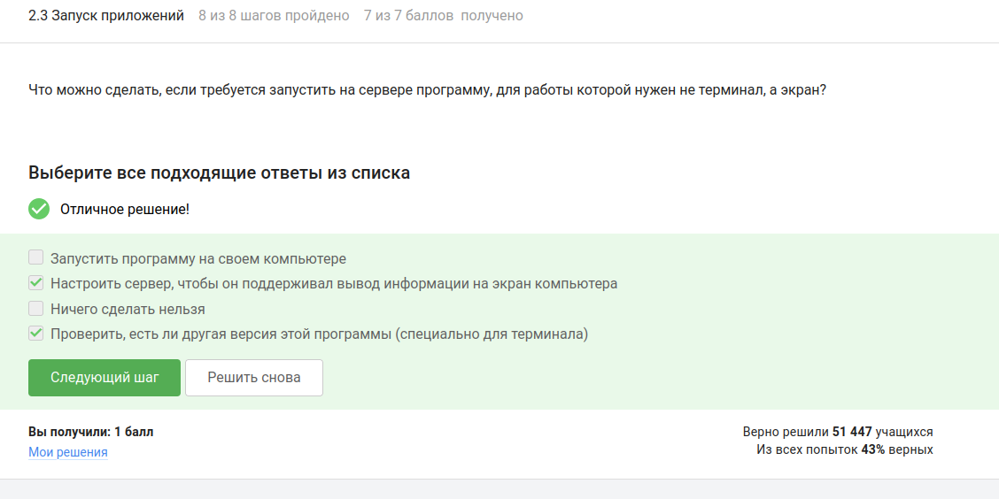
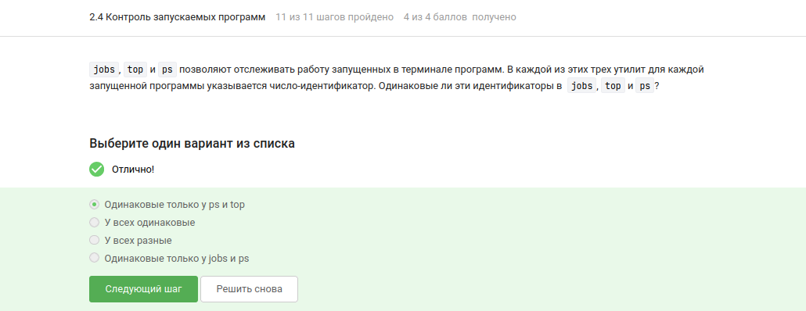
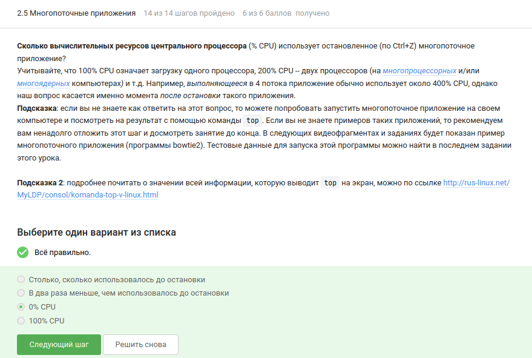
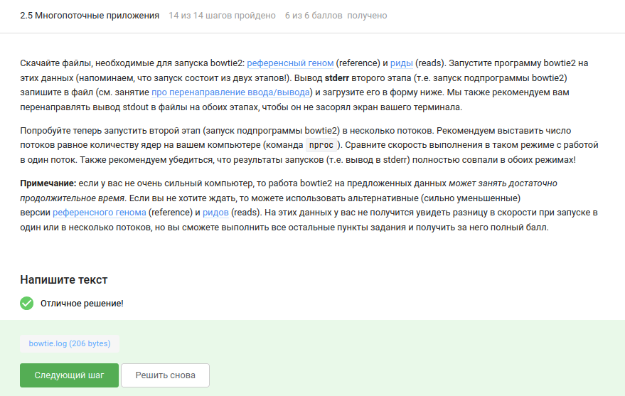
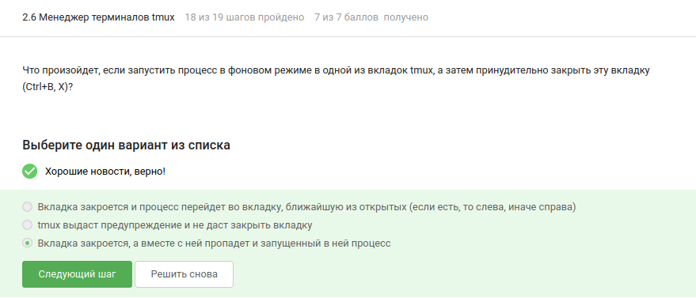
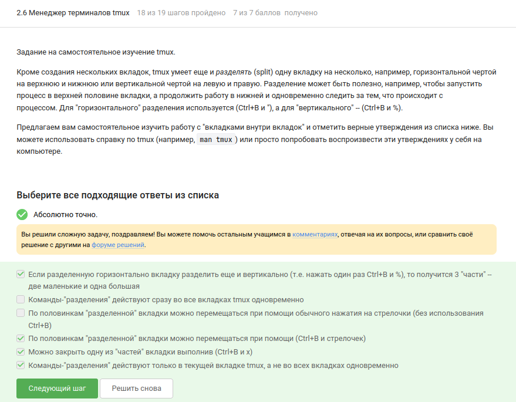

---
## Author
author:
  name: Чамочумби Аксель
  email: 1032252367@rudn.ru
  affiliation:
    - name: Российский университет дружбы народов
      country: Российская Федерация
      postal-code: 117198
      city: Москва
      address: ул. Миклухо-Маклая, д. 7

## Title
title: "Введение в Linux"
subtitle: "Работа на сервере"
license: "CC BY"
number-sections: false
---

# Выполнение внешнего курса

## 2.1. Знакомство с сервером

**Вопрос:** Для каких задач можно использовать удаленный сервер?  
**Ответ:** Для хранения общедоступных данных, хранения конфиденциальных данных, выполнения сложных вычислений, хранения больших объемов данных ([рис. @fig-002]).

{#fig-002 width=70%}

**Вопрос:** Какой из ключей (id_rsa или id_rsa.pub) можно без опаски пересылать по интернету?  
**Ответ:** id_rsa.pub (публичный ключ можно передавать открыто, приватный ключ id_rsa нужно хранить в секрете) ([рис. @fig-003]).

{#fig-003 width=70%}

## 2.2. Обмен файлами

**Вопрос:** Какая команда скопирует на сервер папку stepic со всем содержимым?  
**Ответ:** `scp -r stepic username@server:~/` (опция `-r` означает рекурсивное копирование) ([рис. @fig-004]).

{#fig-004 width=70%}

**Вопрос:** Что делать, если `sudo apt-get install program` не находит установочный пакет?  
**Ответ:** Проверить интернет-соединение и выполнить `sudo apt-get update` (обновление списка пакетов) ([рис. @fig-005]).

{#fig-005 width=70%}

**Вопрос:** Для чего можно использовать программу Filezilla?  
**Ответ:** Для копирования файлов с сервера на свой компьютер, копирования файлов со своего компьютера на сервер, просмотра содержимого директорий на сервере ([рис. @fig-006]).

{#fig-006 width=70%}

## 2.3. Запуск приложений

**Вопрос:** Что делать, если требуется запустить на сервере программу, которая выводит информацию на экран?  
**Ответ:** Проверить, есть ли другая версия этой программы (специально для терминала) ([рис. @fig-007]).

{#fig-007 width=70%}

**Вопрос:** Как обычно можно вызвать справочную информацию о программе `program`?  
**Ответ:** `man program`, `program --help` (в некоторых программах также `-help` или `-h`) ([рис. @fig-008]).

{#fig-008 width=70%}

**Вопрос:** Какие форматы данных может принимать на вход программа FastQC?  
**Ответ:** fastq, fasta, seq ([рис. @fig-009]).

{#fig-009 width=70%}

**Вопрос:** Команда для запуска множественного выравнивания Clustal на файле test.fasta.  
**Ответ:** `clustalw test.fasta -align` ([рис. @fig-010]).

{#fig-010 width=70%}

## 2.4. Контроль запускаемых программ

**Вопрос:** Одинаковые ли идентификаторы процессов в jobs, top и ps?  
**Ответ:** У всех одинаковые (PID процесса одинаков во всех утилитах) ([рис. @fig-012]).

{#fig-012 width=70%}

**Вопрос:** Как мгновенно завершить остановленный процесс?  
**Ответ:** `kill -9` (безусловное завершение процесса) ([рис. @fig-013]).

{#fig-013 width=70%}

**Вопрос:** Что произойдет, если использовать `kill` (без опций) по отношению к процессу, приостановленному через Ctrl+Z?  
**Ответ:** Процесс будет завершен ([рис. @fig-014]).

{#fig-014 width=70%}

## 2.5. Многопоточные приложения

**Вопрос:** Сколько CPU использует остановленное (Ctrl+Z) многопоточное приложение?  
**Ответ:** 0% CPU (остановленный процесс не потребляет процессорное время) ([рис. @fig-015]).

{#fig-015 width=70%}

**Вопрос:** Сколько памяти занимает остановленное многопоточное приложение?  
**Ответ:** Столько, сколько оно потребляло в момент остановки (память не освобождается) ([рис. @fig-016]).

{#fig-016 width=70%}

**Вопрос:** Как принудительно завершить один из потоков многопоточного приложения?  
**Ответ:** Никак (нельзя завершить отдельный поток, не завершив весь процесс) ([рис. @fig-017]).

{#fig-017 width=70%}

**Задание:** Запустили bowtie2 на предоставленных данных, вывод stderr второго этапа сохранили в файл ([рис. @fig-019]).

{#fig-019 width=70%}

## 2.6. Менеджер терминалов tmux

**Вопрос:** Что произойдет, если ввести `exit` в последней открытой вкладке tmux?  
**Ответ:** tmux завершит работу ([рис. @fig-021]).

{#fig-021 width=70%}

**Вопрос:** Что произойдет, если закрыть терминал после запуска tmux на сервере?  
**Ответ:** Соединение с сервером прервется, но работа tmux продолжится (сессия остается активной) ([рис. @fig-022]).

{#fig-022 width=70%}

**Вопрос:** Что произойдет, если запустить процесс в фоне во вкладке tmux и принудительно закрыть вкладку (Ctrl+B, X)?  
**Ответ:** Вкладка закроется, а вместе с ней пропадет и запущенный в ней процесс ([рис. @fig-023]).

{#fig-023 width=70%}

**Вопрос:** Какая команда отвечает за переименование текущей вкладки в tmux?  
**Ответ:** Ctrl+B и , (запятая) ([рис. @fig-024]).

{#fig-024 width=70%}

**Вопрос:** Выберите верные утверждения о разделении вкладок в tmux.  
**Ответ:** 
- Если разделенную горизонтально вкладку разделить ещё и вертикально, то получится 3 "части"
- По половинкам "разделений" можно перемещаться при помощи Ctrl+B и стрелочек
- Можно закрыть одну из "частей" вкладки выполнив Ctrl+B и x
- Команды-"разделения" действуют только в текущей вкладке ([рис. @fig-025]).

{#fig-025 width=70%}

## Выводы

В ходе выполнения заданий раздела **"Работа на сервере"** курса "Введение в Linux" были освоены следующие навыки:

- **Подключение к удаленным серверам** — понимание задач, для которых используются серверы (хранение данных, выполнение сложных вычислений), и безопасная передача SSH-ключей (публичный ключ `id_rsa.pub` можно передавать открыто, приватный `id_rsa` нужно хранить в секрете)

- **Передача файлов** — копирование папок и файлов на сервер и обратно с помощью `scp -r` и программы Filezilla (которая также позволяет просматривать содержимое директорий на сервере)

- **Установка и запуск программ** — решение проблем с установкой через `sudo apt-get update`, получение справочной информации через `man program` или `program --help`, поиск терминальных версий программ для работы на сервере

- **Контроль процессов** — отслеживание идентификаторов процессов (PID) с помощью `jobs`, `top` и `ps` (во всех утилитах PID одинаковые), завершение процессов командами `kill` (обычное завершение) и `kill -9` (мгновенное принудительное завершение)

- **Многопоточные приложения** — понимание того, что остановленный процесс (Ctrl+Z) не потребляет CPU (0%), но сохраняет занятую память; невозможность завершить отдельный поток без завершения всего процесса

- **Терминальный мультиплексор tmux** — управление вкладками и их разделение (горизонтальное и вертикальное), перемещение между частями, переименование вкладок, работа с фоновыми процессами и сохранение сессий при разрыве соединения
