---
## Author
author:
  name: Чамочумби Аксель
  email: 1032252367@rudn.ru
  affiliation:
    - name: Российский университет дружбы народов
      country: Российская Федерация
      postal-code: 117198
      city: Москва
      address: ул. Миклухо-Маклая, д. 7

## Title
title: "Введение в Linux"
subtitle: "Продвинутые темы"
license: "CC BY"
number-sections: false
---

# Выполнение внешнего курса

## 3.1. Текстовый редактор vim

**Вопрос:** Какую клавишу(и) нужно нажать, чтобы выйти из редактора vim?  
**Ответ:** `:`, затем `q`, затем `Enter` (командный режим → команда `:q`) ([рис. @fig-001]).

{#fig-001 width=70%}

**Вопрос:** Разница между `w` и `W`, `e` и `E`, `b` и `B` в vim?  
**Ответ:** `W`, `E`, `B` перемещают по "большим словам" (WORD), игнорируя знаки препинания. Верные утверждения: в строке `Strange_ TEXT is_here. 2=2 YES!` всего 5 "слов" (word), и чтобы попасть в конец строки, нужно меньше нажатий на `W`, чем на `w` ([рис. @fig-002]).

{#fig-002 width=70%}

**Вопрос:** Как преобразовать строку `one two three four five` в `three four four four five`?  
**Ответ:** Набором клавиш `d2wwifour four <Esc>` (удаляем `one two`, переходим в режим вставки и добавляем `four four`) ([рис. @fig-003]).

{#fig-003 width=70%}

**Вопрос:** Как заменить все строки, содержащие `Windows`, на `Linux` (только первое вхождение)?  
**Ответ:** `:%s/Windows/Linux/` (команда замены в vim, `%` — все строки, `s` — substitute) ([рис. @fig-004]).

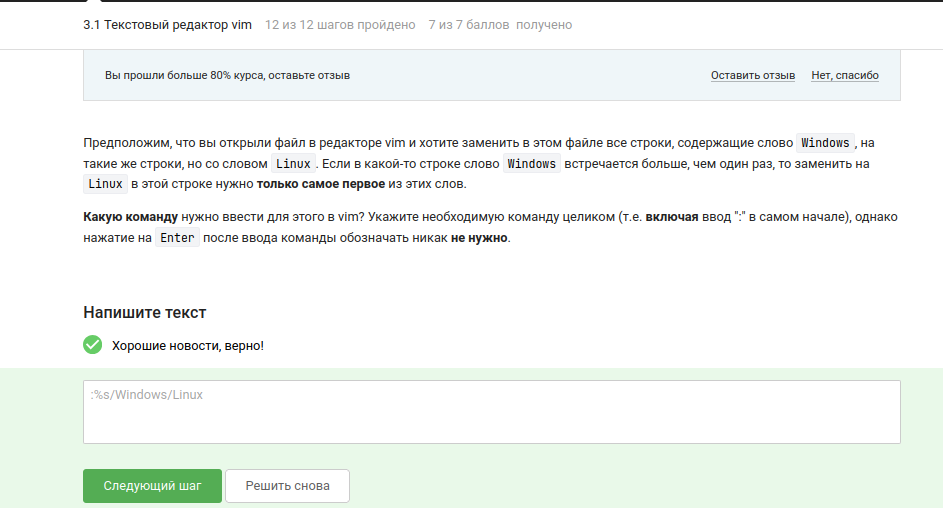{#fig-004 width=70%}

**Вопрос:** Верные утверждения о режиме выделения (Visual) в vim?  
**Ответ:** В режиме выделения можно использовать команды перемещения (`W`, `e`, `$`), он открывается по нажатию `v` из нормального режима, выйти можно нажатием `Esc`, внизу редактора появляется надпись `-- VISUAL --` ([рис. @fig-005]).

{#fig-005 width=70%}

## 3.2. Скрипты на bash: основы

**Вопрос:** История команд при вложенных оболочках (`bash` → `sh` → `bash`)?  
**Ответ:** Команды из последней оболочки (набор `C`). Каждая оболочка имеет свою историю команд ([рис. @fig-006]).

{#fig-006 width=70%}

**Вопрос:** Где будет создан файл после выполнения скрипта с `cd /home/bi/; touch file1.txt`?  
**Ответ:** `/home/bi/file1.txt` (команда `cd /home/bi/` меняет директорию, файл создаётся там) ([рис. @fig-007]).

{#fig-007 width=70%}

**Вопрос:** Какие строки могут быть именами переменных в bash?  
**Ответ:** Только `variable_123` (допустимы буквы, цифры и знак подчёркивания, но цифра не может быть первой) ([рис. @fig-008]).

{#fig-008 width=70%}

**Вопрос:** Скрипт для вывода аргументов `Arguments are: $1=первый $2=второй`?  
**Ответ:** `#!/bin/bash; echo "Arguments are: \$1=$1 \$2=$2"` ([рис. @fig-009]).

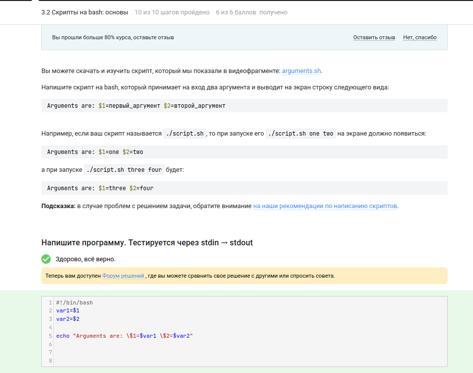{#fig-009 width=70%}

## 3.3. Скрипты на bash: ветвления и циклы

**Вопрос:** Какие условия всегда истинны (`echo "True"` выводится всегда)?  
**Ответ:** `-z ""` (пустая строка имеет нулевую длину) и `5 -ge 5` (5 больше или равно 5) ([рис. @fig-010]).

{#fig-010 width=70%}

**Вопрос:** Что выведет скрипт при `var=3` и `var=5`?  
**Ответ:** `four` и `four` (при 3 → `elif [[ $var -lt 3 ]]` не сработает (3 не меньше 3), → `else`; при 5 → `if [[ $var -gt 5 ]]` не сработает (5 не больше 5)) ([рис. @fig-011]).

{#fig-011 width=70%}

**Вопрос:** Скрипт для вывода числа студентов (1 → "1 student", 2-4 → "2 students", 8 → "No students", ≥5 → "A lot of students")?  
**Ответ:** Реализовано через `case "$1" in` ([рис. @fig-012]).

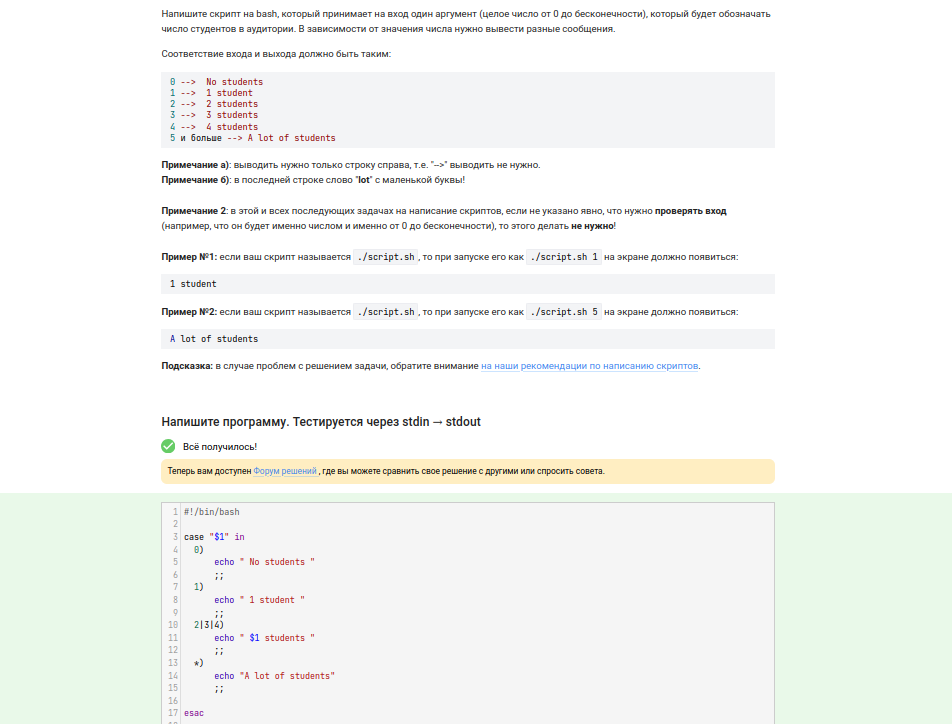{#fig-012 width=70%}

**Вопрос:** Сколько раз выведется `start` и `finish` в цикле `for str in a, b, c_d`?  
**Ответ:** 3 раза `start` и 2 раза `finish` (при `str = c_d` условие `$str > "c"` истинно, `continue` пропускает `finish`) ([рис. @fig-013]).

{#fig-013 width=70%}

**Вопрос:** Скрипт для определения возрастной группы (бесконечный цикл, выход при пустом имени или возрасте 0)?  
**Ответ:** Реализовано через `while true`, `read name`, `read age`, условия `-le 16` → child, `-le 25` → youth, остальные → adult ([рис. @fig-014] y [рис. @fig-015]).

{#fig-014 width=70%}
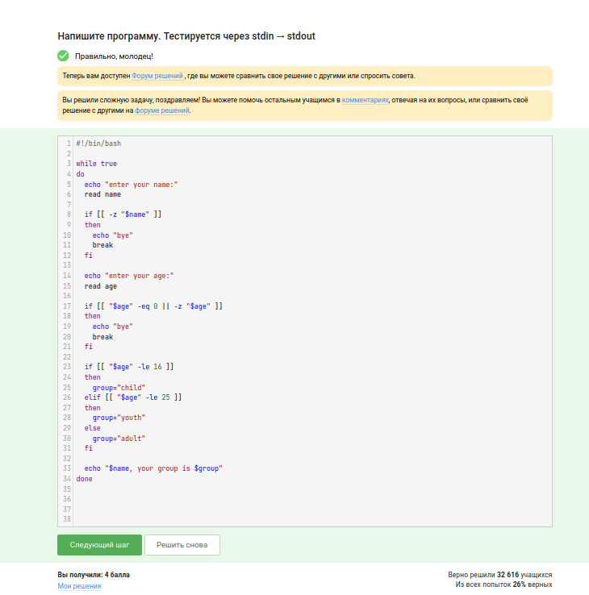{#fig-015 width=70%}

## 3.4. Скрипты на bash: разное

**Вопрос:** Какие инструкции увеличивают `a` на значение `b`?  
**Ответ:** `let "a+=b"`, `let "a=$a+$b"`, `let "a = a + b"` (пробелы важны, но `let` их игнорирует) ([рис. @fig-016]).

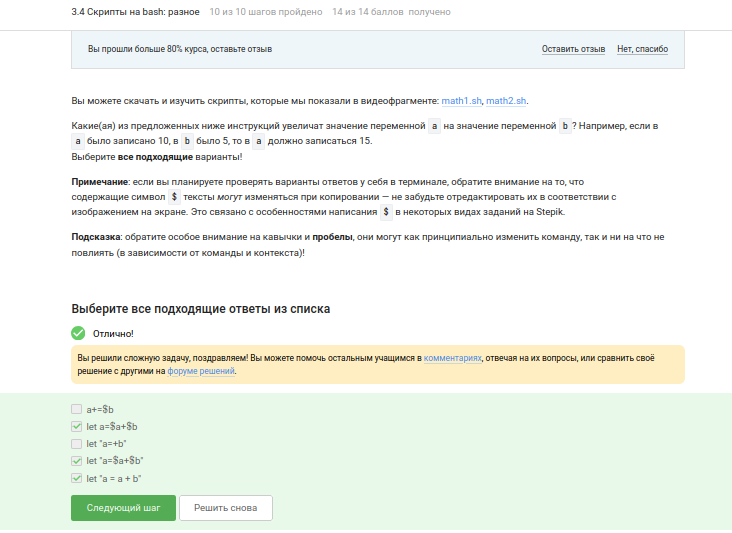{#fig-016 width=70%}

**Вопрос:** Что выведет `echo "pwd"` в скрипте?  
**Ответ:** `pwd` (строка `"pwd"`, а не результат команды, т.к. нет обратных кавычек или `$()`) ([рис. @fig-017]).

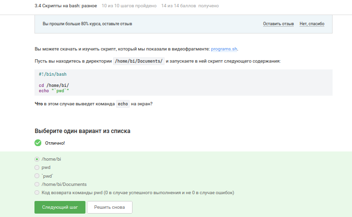{#fig-017 width=70%}

**Вопрос:** Как проверить код возврата программы, которая выводит данные в stdout?  
**Ответ:** Сначала запустить `program`, затем проверить `if [[ $? -eq 0 ]]` (переменная `$?` содержит код возврата последней программы) ([рис. @fig-018]).

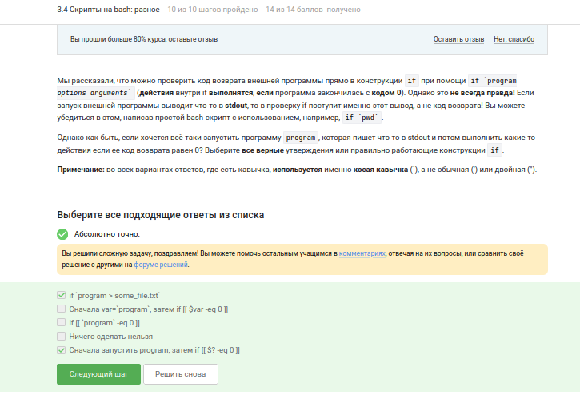{#fig-018 width=70%}

**Вопрос:** Что выведет `echo "counters are $c1 and $c2"` после 10 вызовов функции `counter`?  
**Ответ:** `counters are and 110` (переменная `c1` объявлена как `local`, поэтому она не видна вне функции; `c2` вычисляется как сумма 2+4+6+...+20 = 110) ([рис. @fig-019]).

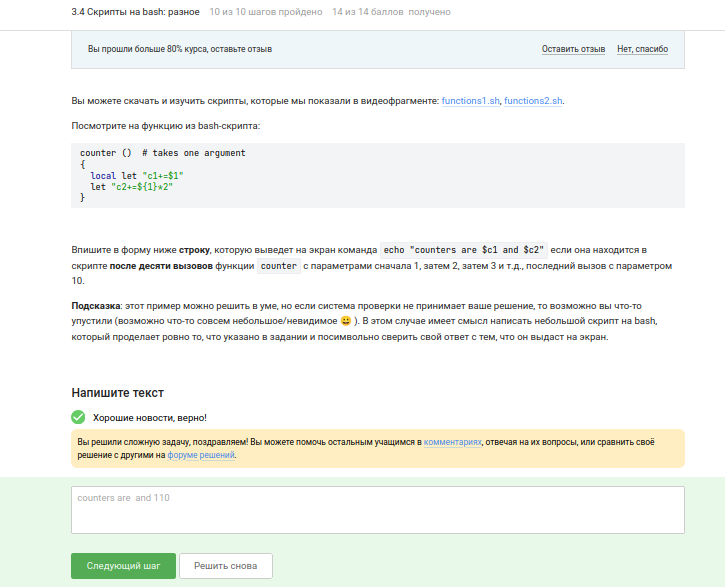{#fig-019 width=70%}

**Вопрос:** Скрипт для вычисления НОД (алгоритм Евклида, бесконечный цикл, выход при пустой строке)?  
**Ответ:** Реализовано через функцию `gcd` с рекурсией ([рис. @fig-020] y [рис. @fig-021]).

{#fig-020 width=70%}
{#fig-021 width=70%}

**Вопрос:** Калькулятор на bash (поддерживает `+`, `-`, `*`, `/`, `%`, `**`, `exit`)?  
**Ответ:** Реализовано через `while read -r arg1 op arg2`, `case $op in` и арифметические операции ([рис. @fig-022] y [рис. @fig-023]).

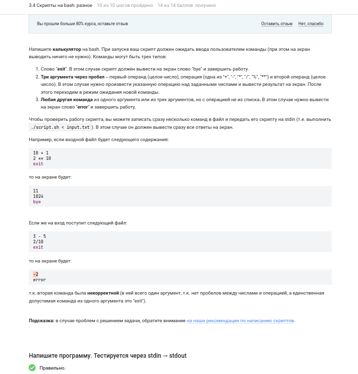{#fig-022 width=70%}
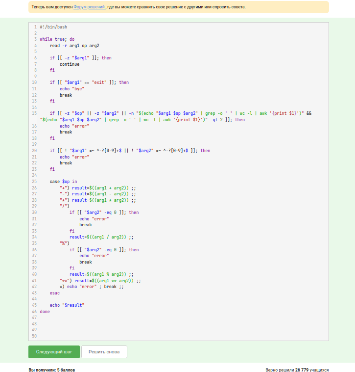{#fig-023 width=70%}

## 3.5. Продвинутый поиск и редактирование

**Вопрос:** Какие файлы найдёт `find -iname "star*"`, но не найдёт `find -name "star*"`?  
**Ответ:** `Star_Wars.avi` и `STARS.txt` (опция `-iname` не учитывает регистр, `-name` чувствительна к регистру) ([рис. @fig-024]).

{#fig-024 width=70%}

**Вопрос:** Верные утверждения об опциях `-path` и `-name`?  
**Ответ:** В некоторых случаях `find` с `-name` найдет меньше файлов, чем с `-path` (например, если нужно искать по полному пути) ([рис. @fig-025]).

{#fig-025 width=70%}

**Вопрос:** Какие файлы найдёт `find -mindepth 2 -maxdepth 3 -name "file*"`?  
**Ответ:** Все кроме `file3` (схема директорий: `file1` на глубине 1, `file2` на глубине 2, `file3` на глубине 4) ([рис. @fig-026]).

{#fig-026 width=70%}

**Вопрос:** Какая команда `grep` создаст файл наибольшего размера?  
**Ответ:** `grep -C 1` (выводит строку с совпадением плюс 1 строку до и после) ([рис. @fig-027]).

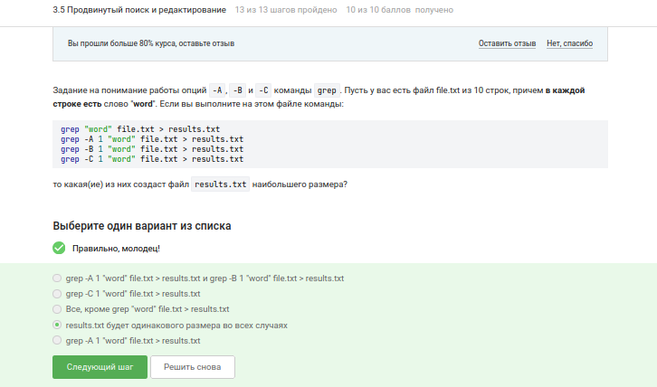{#fig-027 width=70%}

**Вопрос:** Какие строки выведет `grep -E "[x|XKL]?[u|buntu$"`?  
**Ответ:** `Mac OS X, Windows, Ubuntu` и `Lubuntu is better than Windows` (регулярное выражение ищет строки, заканчивающиеся на "buntu" с возможным символом перед) ([рис. @fig-028]).

{#fig-028 width=70%}

**Вопрос:** Что произойдет, если в `sed -n "/[a-z]*/p"` убрать `-n`?  
**Ответ:** Каждая строка будет выведена два раза (без `-n` sed печатает каждую строку, а команда `p` печатает ещё раз) ([рис. @fig-029]).

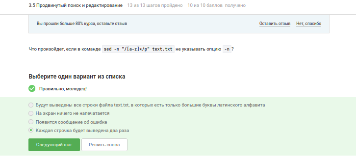{#fig-029 width=70%}

**Вопрос:** Инструкция `sed` для замены "аббревиатур" (2+ заглавные буквы) на "abbreviation"?  
**Ответ:** `sed -E 's/\b[A-Z]{2,}\b/abbreviation/g' input.txt > edited.txt` (регулярное выражение ищет слова из заглавных букв, окружённые границами слова) ([рис. @fig-030]).

{#fig-030 width=70%}

## 3.6. Строим графики в gnuplot

**Вопрос:** Какая опция gnuplot сохраняет графики при закрытии программы?  
**Ответ:** `-p, --persist` (persist — "сохранять") ([рис. @fig-031]).

{#fig-031 width=70%}

**Вопрос:** Название и количество точек на графике при `set key autotitle columnhead`?  
**Ответ:** Название — первое значение из второго столбца, нарисовано 9 точек (первая строка используется как название) ([рис. @fig-032]).

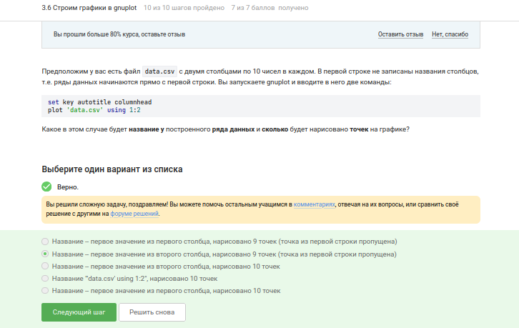{#fig-032 width=70%}

**Вопрос:** Команда для установки трёх делений на оси OX с подписями "point N, value X"?  
**Ответ:** `set xtics ('point 1, value '.x1, 'point 2, value '.x2, 'point 3, value '.x3)` (конкатенация строк в gnuplot) ([рис. @fig-033]).

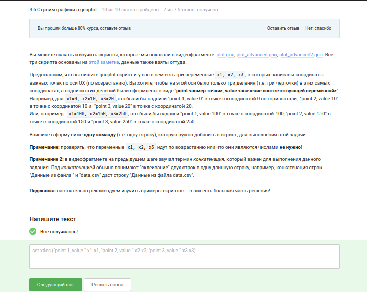{#fig-033 width=70%}

**Вопрос:** Изменение `move.rot` для зеркального отражения графика, обратного и ускоренного вращения?  
**Ответ:** Изменения: `zrot=(zrot+350)%360` (обратное вращение), `pause 0.05` (в два раза быстрее), знак в `splot` не меняется (зеркальное отражение не требуется) ([рис. @fig-034]).

{#fig-034 width=70%}

## 3.7. Разное

**Вопрос:** Команды для установки прав `rwxr-xr--` на файл?  
**Ответ:** `chmod ug+w file.txt; chmod u+x file.txt` и `chmod a+w file.txt; chmod o-wx file.txt; chmod g-x file.txt` ([рис. @fig-035]).

{#fig-035 width=70%}

**Вопрос:** Как дать пользователю из группы `group` право создавать файлы в директории `dir`, созданной `sudo`?  
**Ответ:** `sudo chown user.group dir` и `sudo chown user dir` (меняем владельца директории) ([рис. @fig-036]).

{#fig-036 width=70%}

**Вопрос:** Какие характеристики файла можно посчитать с помощью `wc`?  
**Ответ:** Размер в байтах, количество слов, количество символов, количество строк ([рис. @fig-037]).

{#fig-037 width=70%}

**Вопрос:** Команда для вывода размера текущей директории в удобном формате?  
**Ответ:** `du -h -s` (опция `-h` — человеко-читаемый формат, `-s` — суммарно) ([рис. @fig-038]).

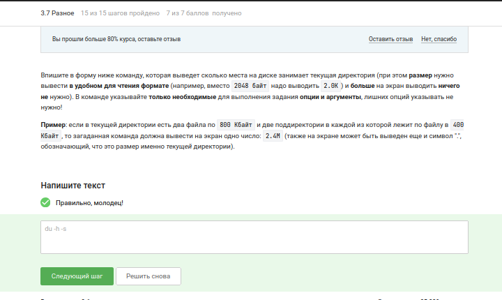{#fig-038 width=70%}

**Вопрос:** Самая короткая команда для создания трёх директорий `dir1`, `dir2`, `dir3`?  
**Ответ:** `mkdir dir{1,2,3}` (фигурные скобки в bash) ([рис. @fig-039]).

{#fig-039 width=70%}

## Сертификат

По окончании курса "Введение в Linux" на платформе Stepik получен сертификат, подтверждающий успешное освоение материала ([рис. @fig-040]).

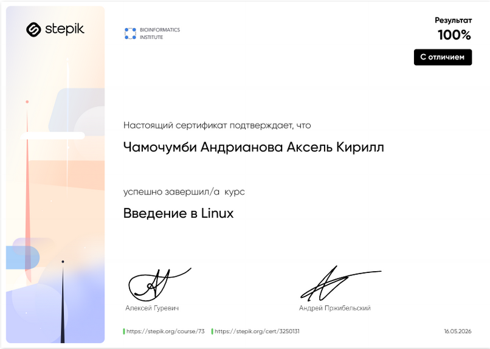{#fig-040 width=70%}

## Выводы

В ходе выполнения заданий раздела **"Продвинутые темы"** курса "Введение в Linux" были освоены следующие навыки:

- **Текстовый редактор vim** — изучены основные режимы работы (нормальный, командный, визуальный), команды для выхода (`:q`), навигация по словам (`w`, `W`, `e`, `E`, `b`, `B`), замена текста (`:%s/old/new/`), работа с визуальным режимом (`v`)

- **Скрипты на bash** — освоены: передача аргументов скрипту (`$1`, `$2`), условные операторы (`if`, `elif`, `else`, `case`), циклы (`for`, `while true`), арифметические операции (`let`), функции (с локальными переменными `local`), проверка кода возврата (`$?`), чтение ввода (`read`)

- **Продвинутый поиск** — освоены команды: `find` с опциями `-name`, `-iname` (учёт регистра), `-path`, `-mindepth`, `-maxdepth`; `grep` с опциями `-A`, `-B`, `-C` (контекст) и регулярными выражениями (`-E`); `sed` для замены текста с использованием регулярных выражений (опции `-E`, `-n`)

- **Построение графиков в gnuplot** — изучены: опция `-persist` для сохранения графиков, настройка заголовков (`set key autotitle columnhead`), установка делений на оси (`set xtics`), конкатенация строк, создание вращающихся графиков (изменение параметров в `move.rot`)

- **Управление правами доступа** — освоены: изменение прав через `chmod` (символьный и восьмеричный режимы), особенности работы с директориями, созданными через `sudo` (необходимость смены владельца)

- **Вспомогательные команды** — `wc` (подсчёт байт, слов, символов, строк), `du -h -s` (размер директории в удобном формате), `mkdir dir{1,2,3}` (создание нескольких директорий одной командой)

- **Сертификат** — по окончании курса получен сертификат Stepik, подтверждающий успешное освоение материала ([рис. @fig-040]).
